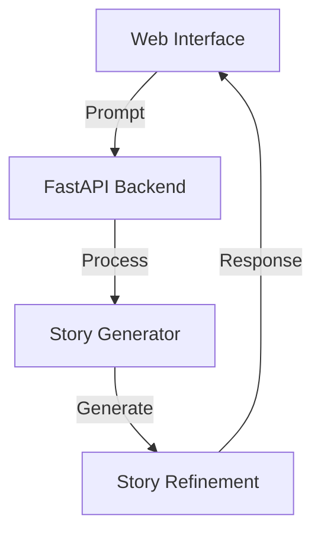

# InkLore 🌟
<div align="center">
  
</div>
An AI-powered story generation system that creates unique narratives from user prompts.

## Overview
InkLore uses a custom-trained lightweight GPT-2 model to generate creative stories. Users can control the creativity level of the generated stories through a temperature parameter, allowing for both focused and highly creative narratives.

## 🔗 Project Links
- [GitHub Repository](https://github.com/Garvit-Nag/InkLore)
- [Initial Training Notebook](https://www.kaggle.com/code/garvitcpp/notebookef69fc93c7)
- [Fine-tuning Notebook](https://www.kaggle.com/code/garvitnag/inklore-fine-tuning)

## 🛠️ Technical Architecture


## 🚀 Features
- Dynamic story generation from user prompts
- Adjustable creativity level (temperature: 0.1-1.0)
- Two-stage text processing pipeline
- Modern, responsive web interface

## 💻 Tech Stack
- **Frontend**: Next.js, Tailwind CSS
- **Backend**: FastAPI, PyTorch
- **Model**: Custom GPT-2 (4 layers, 8 attention heads)

## 🏃‍♂️ Getting Started

### Prerequisites
```bash
# Backend
python 3.8+
pytorch
transformers
fastapi
uvicorn

# Frontend
node 16+
npm or yarn
```

### Installation
1. Clone the repository
```bash
git clone https://github.com/Garvit-Nag/InkLore.git
cd InkLore
```

2. Install backend dependencies
```bash
cd backend
pip install -r requirements.txt
```

3. Install frontend dependencies
```bash
cd frontend
npm install
```

### Running the Application
1. Start the backend server
```bash
cd backend
uvicorn main:app --reload
```

2. Start the frontend development server
```bash
cd frontend
npm run dev
```

The application will be available at `http://localhost:3000`

## 🤝 Contributing
Contributions are welcome! Please feel free to submit a Pull Request.

## 📝 Model Training
The model was trained in two stages:
1. Initial training on TinyStories dataset (20% utilization)
2. Fine-tuning phase with enhanced text processing (30% dataset)

Detailed training procedures can be found in the Kaggle notebooks linked above.

## 📜 License
This project is licensed under the MIT License - see the [LICENSE](LICENSE) file for details.

## 🙋‍♂️ Author
Garvit Nag
- GitHub: [@Garvit-Nag](https://github.com/Garvit-Nag)

## 🌟 Acknowledgments
- [TinyStories Dataset](https://huggingface.co/datasets/roneneldan/TinyStories)
- [Hugging Face Transformers](https://huggingface.co/docs/transformers/index)
